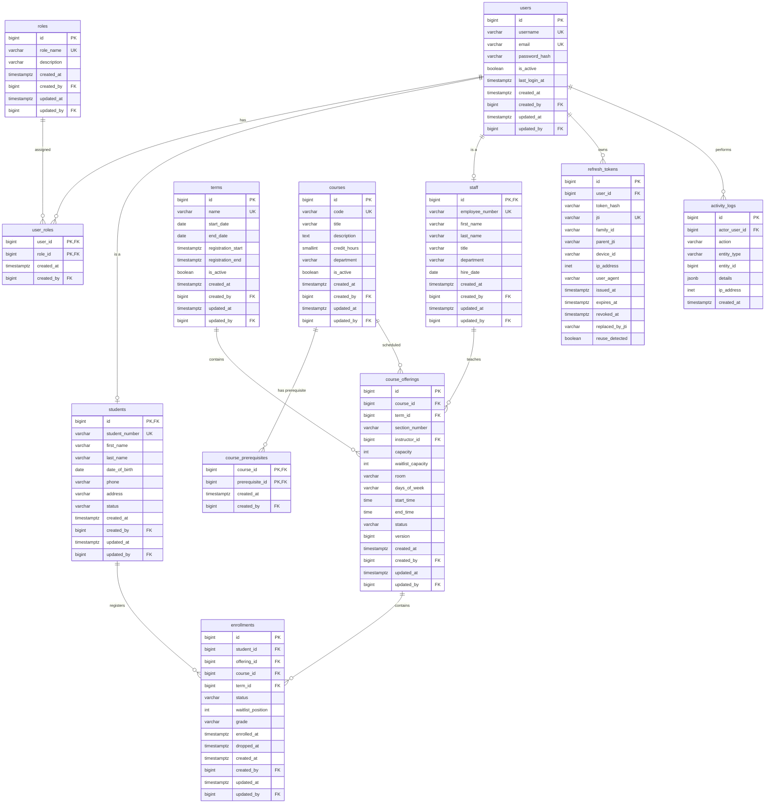
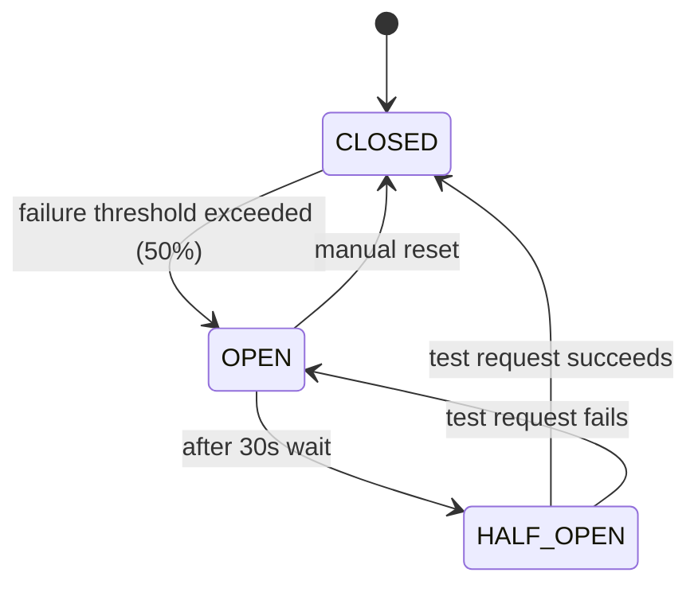

# Student Course Registration API

☕ **Java** 21 | 🍃 **Spring Boot** 4.1.0 | 🐘 **PostgreSQL** 17 | 🪰 **Flyway** 10 | 🔐 **JWT** | 🐳 **Docker** | 📄 **Swagger/OpenAPI** | 📦 **Maven**

---

## Project Overview

A production-grade Spring Boot backend for a **Student Course Registration System**. The system supports course and term management, student and staff administration, secure enrollment with waitlist auto-promotion, JWT-based authentication with refresh token rotation, role-based access control, audit logging, email notifications, and full Docker containerization.

Built with domain-driven modular architecture, optimistic and pessimistic locking for concurrency safety, structured JSON logging, and Resilience4j-based circuit breaking for external dependencies.

---

## Features

### Core
| Feature | Description |
|---------|-------------|
| Course Management | Create, update, delete courses with code, title, description, credit hours, department, prerequisites |
| Course Offering Management | Schedule course sections per term with capacity, waitlist capacity, instructor, room, time, days |
| Term Management | Academic terms with registration windows and active/inactive status |
| Student Management | Create, update, self-profile management, student status lifecycle |
| Staff Management | Create and manage staff users with role assignment (Admin, Registrar, Instructor) |
| Enrollment | Register for courses with capacity enforcement and prerequisite validation |
| Drop Courses | Drop with waitlist auto-promotion and deadline enforcement |
| Waitlist | Automatic waitlisting when course is full, first-in-first-out promotion on drop |
| Schedule View | Students can view their current schedule; staff can view rosters |
| Activity Logging | Every important action is logged with actor, action, entity, details, and IP address |

### Security
| Feature | Description |
|---------|-------------|
| JWT Authentication | Access tokens (default 1h) with refresh token rotation |
| Refresh Token Rotation | Each refresh invalidates the old token; reuse detection revokes entire token family |
| Role-Based Access Control | ADMIN, REGISTRAR, INSTRUCTOR, STUDENT — method-level `@PreAuthorize` guards |
| BCrypt Hashing | Password hashing with strength factor 12 |
| Stateless Architecture | No HTTP sessions; every request authenticated via JWT |
| CORS | Configured for local development origins |

### Reliability & Operations
| Feature | Description |
|---------|-------------|
| Flyway Migrations | Versioned schema migrations + seed data for development |
| Optimistic Locking | Version field on `course_offerings` prevents conflicting updates |
| Pessimistic Locking | `SELECT ... FOR UPDATE` on enrollment critical sections |
| Circuit Breaker | Resilience4j protects email sending with fallback |
| Retry | Automatic retry (3 attempts) for transient email failures |
| Structured Logging | Logstash JSON encoder with MDC correlation (requestId, username, method, path) |
| Global Exception Handling | Consistent `ApiResponse` error format across all endpoints |
| Health Checks | Actuator health/info + custom `DatabaseHealthIndicator` |

### Developer Experience
| Feature | Description |
|---------|-------------|
| OpenAPI / Swagger | Interactive API documentation at `/swagger-ui.html` (dev profile) |
| MapStruct | Type-safe DTO mapping with compile-time code generation |
| Bean Validation | Jakarta Validation annotations on all request DTOs |
| JPA Auditing | Automatic `createdAt`, `updatedAt`, `createdBy`, `updatedBy` |
| Profiled Configuration | `dev` and `prod` profiles with sensible defaults |
| Lombok | Minimal boilerplate on entities and DTOs |
| MailHog | Local email testing via MailHog in Docker Compose |

---

## Architecture Overview

The application follows a **domain-driven modular layered architecture**. Each business domain lives in its own package with a consistent structure:

```
┌─────────────────────────────────────────────────────────────┐
│                     Controller (REST)                       │
│         Request validation, HTTP concerns, @PreAuthorize    │
├─────────────────────────────────────────────────────────────┤
│                       Service Layer                         │
│         Business rules, transaction boundaries, events      │
├─────────────────────────────────────────────────────────────┤
│                   Repository (Spring Data)                  │
│         Data access, pessimistic locks, custom queries      │
├─────────────────────────────────────────────────────────────┤
│                    Entity / JPA Mapping                     │
│         Hibernate ORM, relationships, versioning            │
├─────────────────────────────────────────────────────────────┤
│                   DTO + Mapper (MapStruct)                  │
│         Request/Response records, compile-time mapping      │
└─────────────────────────────────────────────────────────────┘
```

Cross-cutting concerns are isolated in the `infra/` and `shared/` packages:
- **infra/security** — JWT filter, authentication provider, security config
- **infra/config** — CORS, OpenAPI, JPA auditing
- **infra/filter** — Request logging with MDC
- **infra/observability** — Custom health indicators
- **shared/** — `ApiResponse`, `PagedResponse`, `BaseAuditableEntity`, exceptions

---

## Technologies Used

| Category | Technology |
|----------|-----------|
| **Language** | Java 21 |
| **Framework** | Spring Boot 4.1.0 |
| **Web** | Spring MVC |
| **Persistence** | Spring Data JPA, Hibernate, PostgreSQL 17 |
| **Migrations** | Flyway |
| **Security** | Spring Security, JJWT 0.12.6, BCrypt |
| **Mapping** | MapStruct 1.6.3, Lombok |
| **Validation** | Jakarta Bean Validation |
| **API Docs** | Springdoc OpenAPI 3.0.0 |
| **Email** | Spring Mail, Thymeleaf templating, MailHog |
| **Resilience** | Spring Cloud Circuit Breaker (Resilience4j) |
| **Logging** | Logback, Logstash Logback Encoder 8.0 |
| **Monitoring** | Spring Boot Actuator |
| **Container** | Docker, Docker Compose |
| **Build** | Maven |

---

## ERD



---

## Package Structure

```
com.mahmoudramadan.studentregistration
│
├── StudentregistrationApplication.java
│
├── auth/                          # Authentication
│   ├── controller/AuthController.java
│   ├── dto/AuthResponse.java, LoginRequest.java, RefreshTokenRequest.java
│   ├── entity/RefreshToken.java
│   ├── repo/RefreshTokenRepository.java
│   └── service/AuthService.java, RefreshTokenService.java
│
├── user/                          # User & Role management
│   ├── controller/UserController.java
│   ├── dto/UserResponse.java
│   ├── entity/User.java, Role.java
│   ├── enums/RoleName.java
│   ├── mapper/UserMapper.java
│   └── repository/UserRepository.java, RoleRepository.java
│
├── student/                       # Student domain
│   ├── controller/StudentController.java
│   ├── dto/CreateStudentRequest.java, StudentResponse.java, ...
│   ├── entity/Student.java
│   ├── enums/StudentStatus.java
│   ├── mapper/StudentMapper.java
│   ├── repo/StudentRepository.java
│   └── service/StudentService.java
│
├── staff/                         # Staff domain
│   ├── controller/StaffController.java
│   ├── dto/CreateStaffRequest.java, StaffResponse.java, ...
│   ├── entity/Staff.java
│   ├── mapper/StaffMapper.java
│   ├── repo/StaffRepository.java
│   └── service/StaffService.java
│
├── course/                        # Course & Course Offering domain
│   ├── controller/CourseController.java, CourseOfferingController.java
│   ├── dto/... (7 DTOs)
│   ├── entity/Course.java, CourseOffering.java
│   ├── enums/OfferingStatus.java
│   ├── mapper/CourseMapper.java, CourseOfferingMapper.java
│   ├── repo/CourseRepository.java, CourseOfferingRepository.java
│   └── service/CourseService.java, CourseOfferingService.java
│
├── term/                          # Term domain
│   ├── controller/TermController.java
│   ├── dto/CreateTermRequest.java, TermResponse.java, ...
│   ├── entity/Term.java
│   ├── mapper/TermMapper.java
│   ├── repo/TermRepository.java
│   └── service/TermService.java
│
├── enrollment/                    # Enrollment & Waitlist domain
│   ├── controller/EnrollmentController.java
│   ├── dto/EnrollRequest.java, EnrollmentResponse.java
│   ├── entity/Enrollment.java
│   ├── enums/EnrollmentStatus.java
│   ├── event/WaitlistPromotedEvent.java
│   ├── listener/WaitlistPromotedEventListener.java
│   ├── mapper/EnrollmentMapper.java
│   ├── repo/EnrollmentRepository.java
│   └── service/EnrollmentService.java
│
├── activity/                      # Audit / Activity logging
│   ├── controller/ActivityLogController.java
│   ├── dto/ActivityLogResponse.java
│   ├── entity/ActivityLog.java
│   ├── mapper/ActivityLogMapper.java
│   ├── repo/ActivityLogRepository.java
│   └── service/ActivityLogService.java
│
├── notification/                  # Email notifications
│   ├── config/MailProperties.java
│   ├── exception/... (4 custom exceptions)
│   ├── model/EmailMessage.java, EmailModel.java
│   ├── sender/EmailSender.java, SmtpEmailSender.java
│   ├── service/MailService.java
│   └── template/EmailType.java, TemplateRenderer.java
│
├── shared/                        # Cross-cutting shared code
│   ├── dto/ApiResponse.java, PagedResponse.java, PageRequest.java
│   ├── entity/BaseAuditableEntity.java
│   └── exception/BusinessException.java, ResourceNotFoundException.java, GlobalExceptionHandler.java
│
└── infra/                         # Infrastructure
    ├── config/CorsConfig.java, JpaAuditConfig.java, OpenApiConfig.java
    ├── filter/RequestLoggingFilter.java
    ├── observability/DatabaseHealthIndicator.java
    └── security/ (SecurityConfig, JwtAuthFilter, JwtTokenService, JwtProperties, CustomUserDetails*, ...)
```

---

## Authentication

### Flow

```
┌────────┐        ┌────────────┐        ┌──────────┐        ┌──────────┐
│ Client │        │ Auth       │        │ JWT      │        │ Refresh  │
│        │        │ Controller │        │ Service  │        │ Service  │
└───┬────┘        └─────┬──────┘        └────┬─────┘        └────┬─────┘
    │                    │                     │                  │
    │ POST /auth/login   │                     │                  │
    │ username/password  │                     │                  │
    ├───────────────────>│                     │                  │
    │                    │ authenticate()      │                  │
    │                    │────────────────────>│                  │
    │                    │   access token      │                  │
    │                    │<────────────────────│                  │
    │                    │                     │                  │
    │                    │ createRefreshToken()│                  │
    │                    │──────────────────────────────────────>│
    │                    │   refresh token     │                  │
    │                    │<──────────────────────────────────────│
    │ access + refresh   │                     │                  │
    │<───────────────────│                     │                  │
    │                    │                     │                  │
    │ POST /auth/refresh │                     │                  │
    │ refreshToken       │                     │                  │
    ├───────────────────>│                     │                  │
    │                    │ refresh()           │                  │
    │                    │──────────────────────────────────────>│
    │                    │  validates & rotates│                  │
    │                    │  revokes old        │                  │
    │                    │  creates new        │                  │
    │                    │<──────────────────────────────────────│
    │ new access+refresh │                     │                  │
    │<───────────────────│                     │                  │
    │                    │                     │                  │
    │ POST /auth/logout  │                     │                  │
    │ refreshToken       │                     │                  │
    ├───────────────────>│                     │                  │
    │                    │ logout()            │                  │
    │                    │──────────────────────────────────────>│
    │                    │  revokes token      │                  │
    │                    │<──────────────────────────────────────│
    │ 200 OK             │                     │                  │
    │<───────────────────│                     │                  │
```

### Token Details

- **Access Token**: JWT signed with HMAC-SHA256, contains `sub` (username) and `roles`. Default expiry: 1 hour.
- **Refresh Token**: Opaque 64-byte random string (Base64 URL-encoded). Stored as SHA-256 hash. Part of a token family to enable rotation and reuse detection.
- **Refresh Token Rotation**: Each refresh operation issues a new refresh token and revokes the old one. The token family tracks parent-child lineage.
- **Reuse Detection**: If a revoked refresh token is presented (possible token theft scenario), the entire token family is immediately revoked.
- **Logout**: Revokes the presented refresh token.

---

## Authorization

### Roles

| Role | Access Level |
|------|-------------|
| `ADMIN` | Full system access. Manage all resources, view activity logs, override drop deadlines. |
| `REGISTRAR` | Manage courses, offerings, terms, students, and enrollments. |
| `INSTRUCTOR` | View assigned course offerings and their rosters. Cannot modify enrollments. |
| `STUDENT` | Register for and drop own courses. View own schedule and profile. Update own profile. |

### Endpoint Permissions Matrix

| Endpoint | ADMIN | REGISTRAR | INSTRUCTOR | STUDENT | Public |
|----------|-------|-----------|------------|---------|--------|
| `POST /api/v1/auth/login` | | | | | ✓ |
| `POST /api/v1/auth/refresh` | | | | | ✓ |
| `POST /api/v1/auth/logout` | | | | | ✓ |
| `GET /api/v1/users/me` | ✓ | ✓ | ✓ | ✓ | |
| `POST /api/v1/students` | ✓ | ✓ | | | |
| `GET /api/v1/students` | ✓ | ✓ | ✓ | | |
| `GET /api/v1/students/{id}` | ✓ | ✓ | ✓ | own only | |
| `PUT /api/v1/students/{id}` | ✓ | ✓ | | | |
| `PUT /api/v1/students/me` | | | | ✓ | |
| `GET /api/v1/students/{id}/schedule` | ✓ | ✓ | | own only | |
| `POST /api/v1/staff` | ✓ | | | | |
| `GET /api/v1/staff` | ✓ | | | | |
| `GET /api/v1/staff/{id}` | ✓ | | | | |
| `PUT /api/v1/staff/{id}` | ✓ | | | | |
| `POST /api/v1/courses` | ✓ | ✓ | | | |
| `GET /api/v1/courses` | ✓ | ✓ | ✓ | ✓ | |
| `GET /api/v1/courses/{id}` | ✓ | ✓ | ✓ | ✓ | |
| `PUT /api/v1/courses/{id}` | ✓ | ✓ | | | |
| `DELETE /api/v1/courses/{id}` | ✓ | | | | |
| `POST /api/v1/course-offerings` | ✓ | ✓ | | | |
| `GET /api/v1/course-offerings` | ✓ | ✓ | ✓ | ✓ |  |
| `GET /api/v1/course-offerings/{id}` | ✓ | ✓ | ✓ | ✓ | |
| `PUT /api/v1/course-offerings/{id}` | ✓ | ✓ | | | |
| `DELETE /api/v1/course-offerings/{id}` | ✓ | | | | |
| `GET .../course-offerings/{id}/enrollments` | ✓ | ✓ | own only | | |
| `POST /api/v1/enrollments` | ✓ | ✓ | | ✓ | |
| `GET /api/v1/enrollments/{id}` | ✓ | ✓ | ✓ | own only | |
| `PATCH .../enrollments/{id}/drop` | ✓ | ✓ | | own only | |
| `POST /api/v1/terms` | ✓ | ✓ | | | |
| `GET /api/v1/terms` | ✓ | ✓ | ✓ | ✓ | ✓ |
| `GET /api/v1/terms/{id}` | ✓ | ✓ | ✓ | ✓ | ✓ |
| `PUT /api/v1/terms/{id}` | ✓ | ✓ | | | |
| `DELETE /api/v1/terms/{id}` | ✓ | | | | |
| `GET /api/v1/activity-logs` | ✓ | | | | |

---

## Registration Workflow

```
┌────────┐     ┌──────────────┐     ┌──────────────┐     ┌────────────┐
│ Client │     │ Enrollment   │     │ Enrollment   │     │ Course     │
│        │     │ Controller   │     │ Service      │     │ Offering   │
└───┬────┘     └──────┬───────┘     └──────┬───────┘     └──────┬─────┘
    │                  │                    │                   │
    │ POST /enroll     │                    │                   │
    │ {offeringId}     │                    │                   │
    ├─────────────────>│                    │                   │
    │                  │ enroll()           │                   │
    │                  │───────────────────>│                   │
    │                  │                    │ LOCK offering     │
    │                  │                    │ (PESSIMISTIC_WRITE)│
    │                  │                    │──────────────────>│
    │                  │                    │<──────────────────│
    │                  │                    │                   │
    │                  │                    │ verify:           │
    │                  │                    │  - offering OPEN? │
    │                  │                    │  - within reg     │
    │                  │                    │    window?        │
    │                  │                    │  - prerequisites? │
    │                  │                    │  - duplicate?     │
    │                  │                    │                   │
    │                  │                    │ seats available?  │
    │                  │                    │  YES ──▶ ENROLLED │
    │                  │                    │  NO ───▶ waitlist │
    │                  │                    │          cap?     │
    │                  │                    │          YES ──▶  │
    │                  │                    │          WAITLISTED│
    │                  │                    │          NO ──▶   │
    │                  │                    │         "Course   │
    │                  │                    │          is full" │
    │                  │                    │                   │
    │ 201 Enrollment   │                    │                   │
    │ response         │                    │                   │
    │<─────────────────│                    │                   │
```

---

## Waitlist Workflow

### Auto-Promotion on Drop

```
 Drop occurs                     Find first
 (ENROLLED)                      WAITLISTED
    │                               │
    ▼                               ▼
┌───────────┐                 ┌───────────┐
│ Status =  │                 │ Status =  │
│ DROPPED   │                 │ ENROLLED  │
│ droppedAt │                 │ notify    │
│ = now()   │                 │ student   │
└───────────┘                 └───────────┘
    │                               │
    │                               ▼
    │                        Publish Event
    │                        ┌───────────────────────┐
    │                        │ WaitlistPromotedEvent │
    │                        │ @Async email to       │
    │                        │ promoted student      │
    │                        └───────────────────────┘
    │
    ▼
 Renumber remaining
 WAITLISTED positions
```

### Waitlist Rules

- Waitlist is first-in-first-out (ordered by `waitlist_position`).
- When an enrolled student drops, the first waitlisted student is auto-promoted to ENROLLED status.
- A `WaitlistPromotedEvent` is published and an email notification is sent asynchronously.
- Dropping from the waitlist causes remaining waitlist positions to be renumbered.
- Students can be waitlisted only if the offering has available waitlist capacity.

---

## Business Rules

1. **No duplicate active enrollment** — A student cannot have more than one active enrollment (ENROLLED or WAITLISTED) for the same course in the same term. Enforced via a partial unique index on `enrollments` where status IN ('ENROLLED', 'WAITLISTED') and validated in the service layer.

2. **Capacity enforcement** — Registration succeeds only if seats are available. If the offering is full, the student is waitlisted if waitlist capacity permits; otherwise, the request is rejected with "Course is full."

3. **Prerequisite validation** — A student must have completed (or be enrolled in) prerequisite courses before registering for a course that depends on them.

4. **Registration window** — Enrollment is allowed only within the term's registration window (between `registration_start` and `registration_end`).

5. **Offering status** — Enrollment requires the offering to have status `OPEN` or `SCHEDULED`. Closed or cancelled offerings reject new enrollments.

6. **Drop deadline** — Students can drop only before the term's registration end date. Admins and registrars can override this deadline.

7. **Self-service access** — Students can only view and manage their own enrollments, schedule, and profile. Staff with appropriate roles can view any student's data.

---

## API Overview

### Authentication

| Method | Path | Description |
|--------|------|-------------|
| POST | `/api/v1/auth/login` | Authenticate and receive access + refresh tokens |
| POST | `/api/v1/auth/refresh` | Refresh an expiring access token |
| POST | `/api/v1/auth/logout` | Revoke a refresh token |

### Users

| Method | Path | Description |
|--------|------|-------------|
| GET | `/api/v1/users/me` | Get current user profile |

### Students

| Method | Path | Description |
|--------|------|-------------|
| POST | `/api/v1/students` | Create a new student |
| GET | `/api/v1/students` | List all students (paginated) |
| GET | `/api/v1/students/{id}` | Get student by ID |
| PUT | `/api/v1/students/{id}` | Update student (admin/registrar) |
| PUT | `/api/v1/students/me` | Update own profile (student) |
| GET | `/api/v1/students/{id}/schedule` | Get student's current schedule |

### Staff

| Method | Path | Description |
|--------|------|-------------|
| POST | `/api/v1/staff` | Create a new staff member |
| GET | `/api/v1/staff` | List all staff (paginated) |
| GET | `/api/v1/staff/{id}` | Get staff by ID |
| PUT | `/api/v1/staff/{id}` | Update staff member |

### Courses

| Method | Path | Description |
|--------|------|-------------|
| POST | `/api/v1/courses` | Create a course |
| GET | `/api/v1/courses` | List all courses (paginated) |
| GET | `/api/v1/courses/{id}` | Get course by ID |
| PUT | `/api/v1/courses/{id}` | Update course |
| DELETE | `/api/v1/courses/{id}` | Delete course |

### Course Offerings

| Method | Path | Description |
|--------|------|-------------|
| POST | `/api/v1/course-offerings` | Create an offering |
| GET | `/api/v1/course-offerings` | List all offerings (paginated) |
| GET | `/api/v1/course-offerings/{id}` | Get offering by ID |
| PUT | `/api/v1/course-offerings/{id}` | Update offering |
| DELETE | `/api/v1/course-offerings/{id}` | Delete offering |
| GET | `/api/v1/course-offerings/{id}/enrollments` | Get offering roster |

### Enrollments

| Method | Path | Description |
|--------|------|-------------|
| POST | `/api/v1/enrollments` | Enroll in a course (or waitlist) |
| GET | `/api/v1/enrollments/{id}` | Get enrollment by ID |
| PATCH | `/api/v1/enrollments/{id}/drop` | Drop a course |

### Terms

| Method | Path | Description |
|--------|------|-------------|
| POST | `/api/v1/terms` | Create a term |
| GET | `/api/v1/terms` | List all terms (paginated) |
| GET | `/api/v1/terms/{id}` | Get term by ID |
| PUT | `/api/v1/terms/{id}` | Update term |
| DELETE | `/api/v1/terms/{id}` | Delete term |

### Activity Logs

| Method | Path | Description |
|--------|------|-------------|
| GET | `/api/v1/activity-logs` | List activity logs (paginated, filterable) |

### Actuator

| Method | Path | Description |
|--------|------|-------------|
| GET | `/actuator/health` | Health check |
| GET | `/actuator/info` | Application info |

---

## Database

- **PostgreSQL 17** — Relational database
- **Schema** — 10 tables: `users`, `roles`, `user_roles`, `students`, `staff`, `terms`, `courses`, `course_prerequisites`, `course_offerings`, `enrollments`, `activity_logs`, `refresh_tokens`
- **Indexes** — Strategic B-tree indexes on foreign keys and frequent query columns
- **Partial Unique Index** — `uq_enrollment_active_per_course_term` prevents duplicate active enrollments by only indexing rows where status is ENROLLED or WAITLISTED
- **JSONB** — `activity_logs.details` uses PostgreSQL JSONB for flexible structured audit data
- **INET** — IP addresses stored as PostgreSQL `inet` type for `activity_logs` and `refresh_tokens`

---

## Flyway Migrations

| Migration | Description |
|-----------|-------------|
| `V1__init_schema.sql` | Creates all tables, constraints, indexes, and the partial unique enrollment index |
| `V2__add_optimistic_lock_versions.sql` | Adds `version` column to `course_offerings` for optimistic locking |
| `V1000__seed_data.sql` | Seeds roles, users, students, staff, terms, courses, offerings, and enrollments (dev only) |

- Migration discovery follows Flyway's default classpath scanning
- Seed data (`V1000__`) is loaded from `classpath:db/testdata` in the `dev` profile, excluded in `prod`
- Schema is validated on startup (`spring.jpa.hibernate.ddl-auto=validate`) — never auto-generated from entities

---

## Docker

### Dockerfile

Multi-stage build:

- **Stage 1 (builder)**: Maven 3.9.11 + Eclipse Temurin 21. Downloads dependencies offline first, then builds the application JAR.
- **Stage 2 (runtime)**: `amazoncorretto:21-alpine` — minimal JRE image. Runs as a non-root `appuser`. JVM tuned with container-aware flags (`UseContainerSupport`, `MaxRAMPercentage=75.0`).

### Docker Compose

Three services:

| Service | Image | Ports | Purpose |
|---------|-------|-------|---------|
| `backend` | Built from Dockerfile | `8080:8080` | Spring Boot API |
| `postgres` | `postgres:17-alpine` | `5432:5432` | Database with health check |
| `mailhog` | `mailhog/mailhog` | `8025:8025`, `1025:1025` | SMTP testing web UI |

Network: isolated bridge network (`app-network`). Volumes: `postgres-data` (persistent), `app-logs` (application logs).

---

## Getting Started

Clone the repository (required for both local and Docker setups):

```bash
git clone https://github.com/Mahmoud-Ramadan2/student-course-registration.git
cd student-course-registration/backend
```

---

## Running Locally

### Prerequisites

- Java 21+
- Maven 3.9+
- PostgreSQL 17 (running on `localhost:5432`)

### Steps

```bash
# 1. Create the database
psql -U postgres -c "CREATE DATABASE course_registration;"
psql -U postgres -c "CREATE USER admin WITH PASSWORD 'admin_pw';"
psql -U postgres -c "GRANT ALL PRIVILEGES ON DATABASE course_registration TO admin;"

# 2. Run the application (dev profile activates automatically)
./mvnw spring-boot:run

# Or build and run
./mvnw clean package -DskipTests
java -jar target/student-course-registration-api.jar
```

The application starts on `http://localhost:8080`. Swagger UI is available at `http://localhost:8080/swagger-ui.html`.

---

## Running with Docker

```bash
# Build and start all services
docker compose up --build

# Run in background
docker compose up --build -d

# View logs
docker compose logs -f backend

# Stop
docker compose down

# Stop and remove volumes (reset database)
docker compose down -v
```

Access:
- API: `http://localhost:8080`
- Swagger UI: `http://localhost:8080/swagger-ui.html`
- MailHog UI: `http://localhost:8025`

---

## Environment Variables

| Variable | Default | Description |
|----------|---------|-------------|
| `SPRING_PROFILES_ACTIVE` | `dev` | Active Spring profile |
| `DB_URL` | `jdbc:postgresql://localhost:5432/course_registration` | JDBC URL |
| `DB_USER` | `admin` | Database username |
| `DB_PASSWORD` | `admin_pw` | Database password |
| `DB_USERNAME` | (same as DB_USER) | Alternative username var (prod) |
| `JWT_SECRET` | (hardcoded dev secret) | HMAC-SHA signing key (Base64) |
| `JWT_ACCESS_TOKEN_EXPIRATION_MS` | `3600000` | Access token TTL (1 hour) |
| `JWT_REFRESH_TOKEN_EXPIRATION_MS` | `604800000` | Refresh token TTL (7 days) |
| `MAIL_PROVIDER` | `smtp` | Email provider (smtp / none) |
| `MAIL_FROM` | `noreply@university.edu` | From address |
| `MAIL_SUPPORT_EMAIL` | `support@university.edu` | Support email in templates |
| `APP_NAME` | `Student Course Registration` | App name in email templates |

> **Important**: Change the `JWT_SECRET` in production. The dev default is for development only.

---

## Logging

### Structured JSON (Production)

All log entries are emitted as JSON using the Logstash encoder with the following MDC fields:

```json
{
  "@timestamp": "2026-07-28T10:30:00.000Z",
  "level": "INFO",
  "logger": "com.mahmoudramadan.studentregistration.infra.filter.RequestLoggingFilter",
  "message": "HTTP 200 POST /api/v1/enrollments completed in 45ms",
  "mdc": {
    "requestId": "a1b2c3d4-e5f6-7890-abcd-ef1234567890",
    "username": "student1",
    "method": "POST",
    "path": "/api/v1/enrollments"
  }
}
```

### Profiles

| Profile | Console Format | File Appender | SQL Logging |
|---------|---------------|---------------|-------------|
| `dev` | Human-readable (colorized) | JSON (rolling) | DEBUG SQL + bind params |
| `prod` | JSON (Logstash) | JSON (rolling) | OFF |

### Log Files

- Location: `logs/application.log`
- Rolling policy: 20 MB per file, 30-day history, 1 GB total cap

### Request Logging Filter

A custom `OncePerRequestFilter` generates a unique `X-Request-ID` header for each incoming request, populates MDC with `requestId`, `username`, `method`, and `path`, logs every HTTP request with status and duration (e.g., `HTTP 200 POST /api/v1/enrollments completed in 45ms`), and skips `/actuator` paths to avoid noise.

---

## Error Handling

All API responses follow a consistent `ApiResponse` wrapper:

```json
{
  "success": false,
  "data": null,
  "message": "Course offering is full",
  "timestamp": "2026-07-28T10:30:00.000Z",
  "requestId": "a1b2c3d4-e5f6-7890-abcd-ef1234567890"
}
```

Validation errors include field-level details:

```json
{
  "success": false,
  "data": {
    "password": "Password must be at least 8 characters",
    "email": "Email must be a valid email address"
  },
  "message": "Validation failed",
  "timestamp": "2026-07-28T10:30:00.000Z",
  "requestId": "a1b2c3d4-e5f6-7890-abcd-ef1234567890"
}
```

### HTTP Status Code Mapping

| Status | When |
|--------|------|
| `200 OK` | Successful read/update operations |
| `201 Created` | Successful resource creation |
| `400 Bad Request` | Validation failure, business rule violation, bad request body |
| `401 Unauthorized` | Missing/invalid JWT, bad credentials |
| `403 Forbidden` | Insufficient role permissions |
| `404 Not Found` | Resource does not exist |
| `405 Method Not Allowed` | HTTP method not supported for endpoint |
| `409 Conflict` | Optimistic/pessimistic lock conflict |
| `415 Unsupported Media Type` | Unsupported Content-Type |
| `500 Internal Server Error` | Unexpected server error |

---

## Security

| Measure | Implementation |
|---------|---------------|
| **Authentication** | JWT access tokens (1h) + refresh tokens (7d) with rotation |
| **Refresh Token Rotation** | Each refresh invalidates the old token and creates a new one in the same family |
| **Reuse Detection** | Presenting a revoked token revokes the entire token family |
| **Password Storage** | BCrypt with strength factor 12 |
| **Transport** | CSRF disabled (stateless API); production requires HTTPS |
| **Session** | Stateless — no HTTP sessions  |
| **CORS** | Whitelisted origins: `http://localhost:3000`, `http://localhost:5173` |
| **Actuator** | `/actuator/**` restricted to ADMIN role |
| **Swagger** | Disabled in production profile |

---

## Concurrency Handling

### Pessimistic Locking (Enrollment)

During enrollment and drop operations, the affected `course_offerings` row is locked with `PESSIMISTIC_WRITE` (`SELECT ... FOR UPDATE`). This prevents race conditions where two concurrent requests could enroll the last available seat or exceed capacity.

```java
@Lock(PessimisticLockScope.PESSIMISTIC_WRITE)
@Query("SELECT co FROM CourseOffering co WHERE co.id = :id")
Optional<CourseOffering> findByIdForUpdate(@Param("id") Long id);
```

### Optimistic Locking (Course Offerings)

The `course_offerings` table has a `version` column (`BIGINT DEFAULT 0`). Hibernate's optimistic locking detects concurrent modifications and throws `OptimisticLockException`, mapped to HTTP 409 Conflict by the global exception handler.

### Lock Exception Handling

The `GlobalExceptionHandler` catches:
- `OptimisticLockException` → 409
- `PessimisticLockingFailureException` → 409
- `CannotAcquireLockException` → 409
- `LockTimeoutException` → 409
- `DeadlockLoserDataAccessException` → 409

---

## Resilience

Email sending uses Resilience4j with a Circuit Breaker and Retry to handle transient SMTP failures gracefully without impacting API response times.



### Circuit Breaker (`emailBreaker`)

| Property | Value |
|----------|-------|
| Sliding window type | Count-based |
| Window size | 10 calls |
| Failure rate threshold | 50% |
| Wait duration in OPEN state | 30s |
| Half-open test calls | 3 |
| Auto transition | Enabled |

### Retry (`emailRetry`)

- Max 3 attempts with 2-second wait between attempts
- Retries on `MailSendException` and `MailSendingException`

### Fallback

When the circuit is open or all retries are exhausted, the fallback method logs the error silently without rethrowing, ensuring the calling enrollment operation succeeds regardless of email status.

---

## Postman / Swagger

### Swagger UI (Development)

The API is fully documented with OpenAPI 3.0 via Springdoc. With the application running (dev profile), visit:

```
http://localhost:8080/swagger-ui.html
```

### Postman Collection

You can import the Postman collection in two ways:

1. **From the local file** — Import `docs/student-course-registration-api.postman_collection.json` directly into Postman
2. **From the running API** — Visit `http://localhost:8080/v3/api-docs`, save the JSON, and import into Postman using **Import → File**

---

## Author

**Mahmoud Ramadan**

- Package: `com.mahmoudramadan`
- Repository: [Student Course Registration](https://github.com/Mahmoud-Ramadan2/student-course-registration)

---

